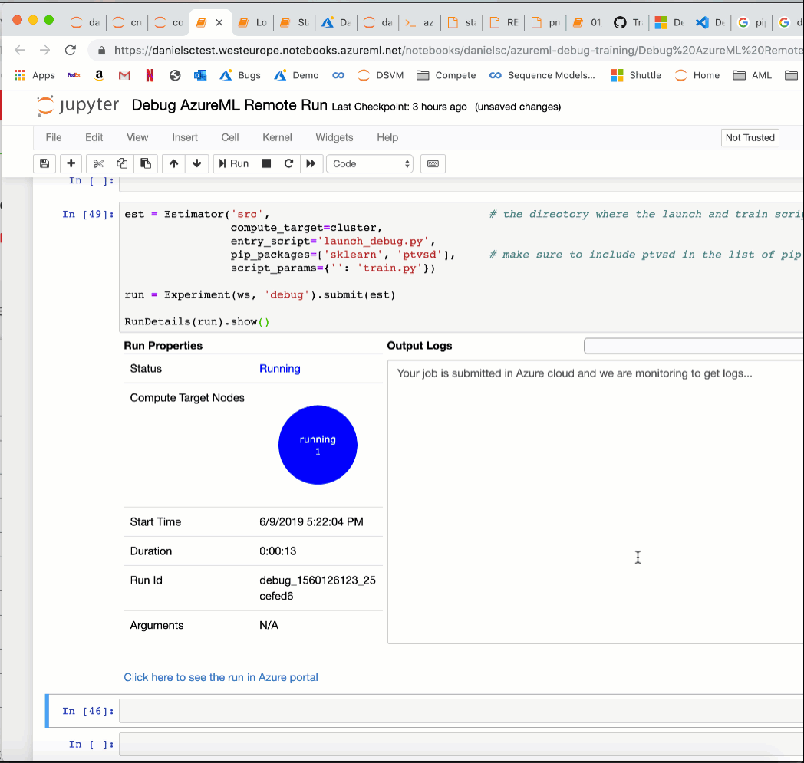

# azureml-debug-training

This repos shows how to debug an AzureML remote run using VSCode remote debugging with the Python Tools Visual Studio Debugger. 

While you want to do as much of your debugging as possible on the machine where your development tools are running, sometimes you need to debug on a cluster/remote compute. For instance a certain issue might only occur when running on the cluster or your production job failed and you want to inspect what happened by inspecting variables in memory.

This repository shows how to set up the networking required to debug a job that is running on an AzureML Compute cluster from an AzureML Notebook VM. The debugger is running on a VSCode Remote instance on the Notebook VM and attaches to the debug agent running inside the job on the AML Compute cluster. While all examples are using a Notebook VM, everything should work the same way from your local dev box (only maybe slower).

## Installation

Go here for [Setting up VSCode Remote on an AzureML Notebook VM](Setting%20up%20VSCode%20Remote%20on%20an%20AzureML%20Notebook%20VM.md) for how to set up VSCode Remote on an AzuremML Notebook VM.

Next, log in to your Notebook VM and open a terminal window (in the top right corner of the Jupyter view click 'New', then 'Terminal')
- activate the conda environment you wish to use
```shell    
    conda activate py36
```    
- Install Python Tools Visual Studio Debugger (not strictly required on the Notebook VM, but a good idea when testing the setup locally
```shell
    pip install ptvsd
```    
- Next go to the folder where you keep your git projects and clone this repository
```shell
    git clone https://github.com/danielsc/azureml-debug-training
```
    
Then see [Debug AzureML Remote Run](Debug%20AzureML%20Remote%20Run.ipynb) for instructions on the debugging process.




